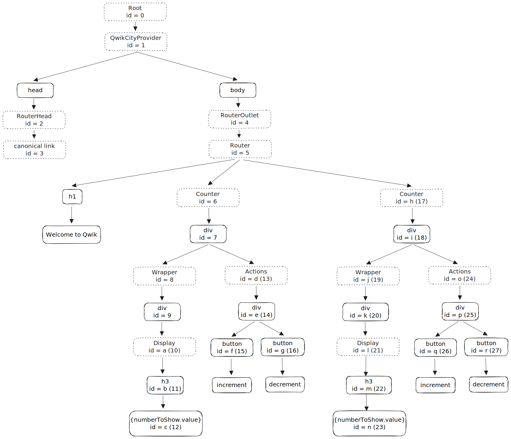

# Let's deep dive into Qwik

## Visual Element Graph



## Serialized State

Qwik serializes many things on the server and add them into:

- `<script type="qwik/json"></script>`
- `<script q:func="qwik/json"></script>`

### Qwik JSON

- refs: `Map<elementId, objId>`, is used to get the objects for the captured state
- ctx: don't know yet
- objs: the serialized objects, need to use `getObject` before using them on the client
- subs: the subscriptions, represent which element subscribes which signal

```ts
const qwikjson = {
  refs: {
    f: "a!", // the captured state for element with "q:id=f" is the "a" object, and "!" represents it's a Proxy
    g: "a!",
    q: "j!", // the captured state for element with "q:id=q" is the "j" object, and "!" represents it's a Proxy
    r: "j!",
  },
  ctx: {},
  objs: [
    "\u00122", // 0, serialized by SignalSerializer
    "\u0012b", // 1, serialized by SignalSerializer
    10, // 2
    "leo", // 3
    {
      identifier: "3",
      initialCount: "2",
    }, // 4
    "\u00114! @0", // 5, serialized by DerivedSignalSerializer
    {
      numberToShow: "0",
      $$identifier: "5",
    }, // 6
    "\u00116! @1", // 7, serialized by DerivedSignalSerializer
    "#c", // 8
    "\u00114! @0", // 9, serialized by DerivedSignalSerializer
    {
      count: "0",
      $$identifier: "9",
    }, // a
    5, // b
    "una", // c
    {
      identifier: "c",
      initialCount: "b",
    }, // d
    "\u0011d! @0", // e, serialized by DerivedSignalSerializer
    {
      numberToShow: "1",
      $$identifier: "e",
    }, // f
    "\u0011f! @1", // g, serialized by DerivedSignalSerializer
    "#n", // h
    "\u0011d! @0", // i, serialized by DerivedSignalSerializer
    {
      count: "1",
      $$identifier: "i",
    }, // j
  ],
  subs: [
    // [type, host, signal, elm, key]
    ["3 #c 7 #c"], // the element with "q:id=c" subscribes the "7" object, which is "\u00116! @1" (a SignalDerived instance)
    ["3 #n g #n"], // the element with "q:id=n" subscribes the "g" object, which is "\u0011f! @1" (a SignalDerived instance)
  ],
};
```

### Qwik Functions

Functions for mapping the data derived from signals.

```ts
document.currentScript.qFuncs = [
  (p0) => p0.identifier, // for getObject("@0")
  (p0) => p0.numberToShow.value, // for getObject("@1")
];
```

## Qwikloader

Qwikloader lazy-loads and execute the serialized event handlers by registering global events.

See https://qwik.builder.io/docs/advanced/qwikloader/.

## useLexicalScope

To avoid downloading all the templates, we need to be able to rehydrate each component independently and in any order. And the key is making event listeners don't close over code, until after the user interacts with the listener.

`useLexicalScope` returns state that crosses over the code.

For example, `Actions` has two event listeners that cross over the props:

```ts
export const Actions = component$<IActionsProps>((props) => {
  console.log(`Actions-${props.identifier}`);

  const plus = $(() => props.count.value++);
  const minus = $(() => props.count.value--);

  return (
    <div class={`Actions-${props.identifier}`}>
      <button onClick$={plus}>increment</button>
      <button onClick$={minus}>decrement</button>
    </div>
  );
});
```

Qwik transform it into:

```ts
import { useLexicalScope } from "/node_modules/@builder.io/qwik/core.mjs?v=2c948b3f";
export const Actions_component_minus_q0etFf0m1KE = () => {
  const [props] = useLexicalScope();
  return props.count.value--;
};
```

```ts
import { useLexicalScope } from "/node_modules/@builder.io/qwik/core.mjs?v=2c948b3f";
export const Actions_component_plus_47uPif0oZDc = () => {
  const [props] = useLexicalScope();
  return props.count.value++;
};
```

## resume

When the page is rendered on the server, it is paused. So, when users interact with the page, Qwik needs to resume the page.

`<html q:container="paused">` --> `<html q:container="resume">`

1. get qwik json and inline functions
2. create `ContainerState` for container element
3. collect all elements with a tree walker (both virtual elements and real elements)
4. create a parser that can deserialize objects based on their prefix
5. add `getObject` function into the `containerState.$pauseCtx$`
6. emit `qresume` event

### getObject

`getObject: (id: string) => any`

`getObject` returns the computed object in the `finalized` Map. Otherwise, compute the object.

### computeObject

`computeObject: (id: string) => any`

Trivial cases:

- Object is a HTML element if the id starts with `#`.
- Object is an inline function if the id starts with `@`.
- Object is a Text node if the id starts with `*`.

Compute the objects in the paused state is a little more complex.

1. get object from the `pauseState.objs`
2. prepare it with parser if the object is a string (ex: "\u00122")
3. transform the object if the object ends with `!`, `~` or `_`
4. revive subscriptions and the nested values if the object isn't a primitive value

#### revive subscription

Qwik produces the reactivity graph on the server and serializes it into the HTML. So Qwik doesn't need to download and execute all the templates to make the page reactive.

See https://www.builder.io/blog/history-of-reactivity#qwik.

For example, `["3 #c 7 #c"]` is the serialized subscription for object 0, means that object 0 has a type 3 subscription. Qwik will parse this subscription and add it to the object 0's `$subs$` of its local subscription manager.

#### revive nested objects

There might be some un-computed object ids inside the object. So, Qwik need to map those object ids into objects by either the serializer's `$fill$` method or by `getObject` directly.

## ContainerState

A container state will be created in the process of resuming. A container state will be attached to the container element (usually the html element) with `Symbol('ContainerState')` as its key.

### `$pauseCtx$`

```ts
interface PauseContext {
  getObject: GetObject;
  meta: SnapshotMeta;
  refs: Record<string, string>;
}
```

In the `resumeContainer`, it got filled with:

```ts
containerState.$pauseCtx$ = {
  getObject,
  meta: pauseState.ctx,
  refs: pauseState.refs,
};
```

### `$subsManager$`

A SubscriptionManager created right after the container state got created (`createContainerState`):

```ts
containerState.$subsManager$ = createSubscriptionManager(containerState);
```

## QContext

In the `useLexicalScope`, after the container is resumed, Qwik will create a QContext for the element of current InvokeContext. `getContext` gets the refMap from the `containerState.$pauseCtx$.refs` then deserializes the object by the `containerState.$pauseCtx$.getObject`.

For example:

```ts
refs: {
  f: "a!",
  g: "a!",
  q: "j!",
  r: "j!",
},
```

If the invoke element is "g", its refMap is "a!". `getObject("a!")` gives us the object that captures the lexical scope's state.

```ts
qContext.$refMap$ = [getObject("a!")];
```

This `$refMap$` will be used to build the `$captureRef$` by `qrl.$capture$` in the `inflateQrl` function.

## Parser

## Serializer

### prepare

### fill

## Signal

### SignalImpl

### SignalDerived

## Proxy

## QRL

- hash
- chunk
- symbol
- capture

---

SSR HTML:

```html
<html
  lang="en-us"
  q:container="paused"
  q:version="1.2.2"
  q:render="ssr-dev"
  q:base="/build/"
  q:locale
  q:manifest-hash="dev"
>
  <!--qv q:id=0 q:key=3scc:pY_0-->
  <!--qv q:id=1 q:key=TxCF:35_3-->
  <!--qv q:s q:sref=1 q:key=-->
  <head q:head>
    <meta charset="utf-8" q:head />
    <link href="/manifest.json" rel="manifest" q:head />
    <!--qv q:id=2 q:key=zrbr:35_0-->
    <!--qv q:key=OA_0-->
    <title q:head>Welcome to Qwik</title>
    <link href="http://127.0.0.1:5173/" rel="canonical" q:id="3" q:head />
    <meta
      content="width=device-width, initial-scale=1.0"
      name="viewport"
      q:head
    />
    <link href="/favicon.svg" rel="icon" type="image/svg+xml" q:head />
    <meta name="description" content="Qwik site description" q:head />
    <!--/qv-->
    <!--/qv-->
    <!--qv q:key=35_1-->
    <script q:key="1Z_0" q:head>
      navigator.serviceWorker?.getRegistrations().then((regs) => {
        for (const reg of regs) {
          reg.unregister();
        }
      });
    </script>
    <!--/qv-->
    <link rel="stylesheet" href="/src/global.css" />
    <style q:style="lcydw1-0" hidden>
      :root {
        view-transition-name: none;
      }
    </style>
  </head>
  <body lang="en">
    <!--qv q:id=4 q:key=e0ss:35_2-->
    <!--qv q:key=zl_1-->
    <!--qv q:id=5 q:key=xYL1:zl_0-->
    <!--qv q:key=H1_2-->
    <h1>Welcome to Qwik</h1>
    <!--qv q:id=6 q:key=fuEi:H1_0-->
    <div class="Counter-leo" q:key="QP_2" q:id="7">
      <h2>LEO Counter</h2>
      <!--qv q:id=8 q:key=6wO8:QP_0-->
      <div class="Wrapper-leo" q:key="GD_1" q:id="9">
        <!--qv q:id=a q:key=XVGg:GD_0-->
        <h3 class="Display-leo" q:key="Gs_0" q:id="b">
          <!--t=c-->
          10
          <!---->
        </h3>
        <!--/qv-->
      </div>
      <!--/qv-->
      <!--qv q:id=d q:key=CCNe:QP_1-->
      <div class="Incrementor-leo" q:key="ya_0" q:id="e">
        <button
          on:click="/src/incrementor_component_increment_l08ehexzmfy.js#Incrementor_component_increment_l08EhexZMFY[0]"
          q:id="f"
        >
          increment value
        </button>
        <button
          on:click="/src/incrementor_component_decrement_u0vmeemhaz4.js#Incrementor_component_decrement_U0vmeEMhaZ4[0]"
          q:id="g"
        >
          decrement value
        </button>
      </div>
      <!--/qv-->
    </div>
    <!--/qv-->
    <!--qv q:id=h q:key=fuEi:H1_1-->
    <div class="Counter-una" q:key="QP_2" q:id="i">
      <h2>UNA Counter</h2>
      <!--qv q:id=j q:key=6wO8:QP_0-->
      <div class="Wrapper-una" q:key="GD_1" q:id="k">
        <!--qv q:id=l q:key=XVGg:GD_0-->
        <h3 class="Display-una" q:key="Gs_0" q:id="m">
          <!--t=n-->
          5
          <!---->
        </h3>
        <!--/qv-->
      </div>
      <!--/qv-->
      <!--qv q:id=o q:key=CCNe:QP_1-->
      <div class="Incrementor-una" q:key="ya_0" q:id="p">
        <button
          on:click="/src/incrementor_component_increment_l08ehexzmfy.js#Incrementor_component_increment_l08EhexZMFY[0]"
          q:id="q"
        >
          increment value
        </button>
        <button
          on:click="/src/incrementor_component_decrement_u0vmeemhaz4.js#Incrementor_component_decrement_U0vmeEMhaZ4[0]"
          q:id="r"
        >
          decrement value
        </button>
      </div>
      <!--/qv-->
    </div>
    <!--/qv-->
    <!--/qv-->
    <!--/qv-->
    <!--/qv-->
    <!--/qv-->
  </body>
</html>
```

Serialized inline functions:

```html
<script q:func="qwik/json">
  document.currentScript.qFuncs = [
    (p0) => p0.identifier,
    (p0) => p0.numberToShow.value,
  ];
</script>
```

Serialized state:

- refs
- ctx
- objs
- subs

```json
{
  "refs": {
    "f": "a!",
    "g": "a!",
    "q": "j!",
    "r": "j!"
  },
  "ctx": {},
  "objs": [
    "\u00122",
    "\u0012b",
    10,
    "leo",
    {
      "identifier": "3",
      "initialCount": "2"
    },
    "\u00114! @0",
    {
      "numberToShow": "0",
      "$$identifier": "5"
    },
    "\u00116! @1",
    "#c",
    "\u00114! @0",
    {
      "count": "0",
      "$$identifier": "9"
    },
    5,
    "una",
    {
      "identifier": "c",
      "initialCount": "b"
    },
    "\u0011d! @0",
    {
      "numberToShow": "1",
      "$$identifier": "e"
    },
    "\u0011f! @1",
    "#n",
    "\u0011d! @0",
    {
      "count": "1",
      "$$identifier": "i"
    }
  ],
  "subs": [["3 #c 7 #c"], ["3 #n g #n"]]
}
```
